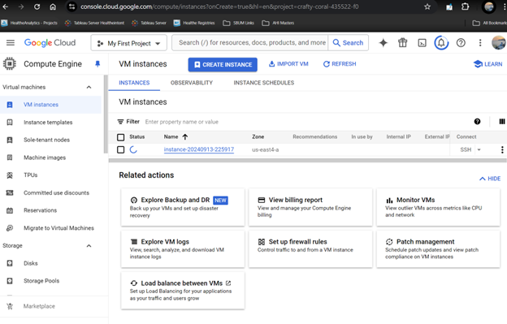
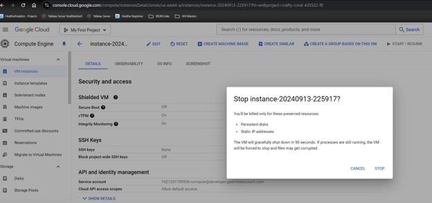

# Working with Virtual Machines in GCP and Azure

## Cost Comparison
I was able to create and run a VM on GCP using the **e2-micro** instance with **Debian GNU/Linux**. The cost was low since it was a basic setup, and the VM only ran for a few minutes. Unfortunately, I couldn't get the VM running in Azure due to permission issues, so I wasn't able to directly compare the costs between the two platforms.

## Reflection
I found GCP to be much easier to use. The interface was simple, and everything from creating to stopping the VM felt intuitive. Azure, on the other hand, was more difficult to navigate, and I couldn't get the VM to run at all. Monitoring costs on GCP was straightforward, but since I couldn't test Azure, I can't fully compare them.

## Screenshots

